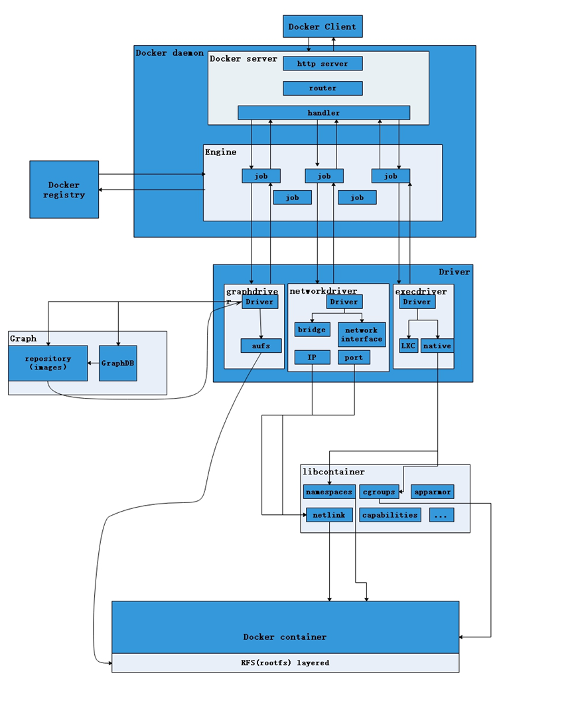

# docker
docker是一种轻量化的容器
## 组成部分
### docker client 
docker client 就是docker给用户提供的客户端，用户输入docker提供的指令来管理本地或者服务器，一般会传入route,image等

### docker deamon
docker server+docker engine+docker
```
Docker服务的守护进程。每台服务器（物理机或虚机）上只要安装了Docker的环境，基本上就跑了一个后台程序Docker Daemon，Docker Daemon会接收Docker Client发过来的指令,并对服务器的进行具体操作。
```
#### docker server 
docker server不是和client直接交互的，而是由容器与client进行交互，然后将信息交给server， server就将这些信息分类，交给下面的engine。
#### docker engine
在docker engine 中就是会创立很多工作进程，各个进程之中是相互独立的，Engine执行Docker内部的一系列工作，每一项工作都是以一个Job的形式的存在。 job是一个执行单元
```（Job的运行过程中，当需要容器镜像时，则从Docker Registry中下载镜像，并通过镜像管理驱动GraphDriver将下载镜像以Graph的形式存储；当需要为Docker创建网络环境时，通过网络管理驱动NetWorkdriver创建并配置Docker容器网络环境；当需要限制Docker容器运行资源或执行用户指令等操作时，则通过ExecDriver来完成。）```
### docker drive
Driver是Docker架构中的驱动模块。通过Driver驱动，Docker可以实现对Docker容器执行环境的定制。由于Docker运行的生命周期中，并非用户所有的操作都是针对Docker容器的管理，另外还有关于Docker运行信息的获取，Graph的存储与记录等。因此，为了将Docker容器的管理从Docker Daemon内部业务逻辑中区分开来，设计了Driver层驱动来接管所有这部分请求。
### other important：
#### Docker Images 
Graph在Docker架构中扮演已下载容器镜像的保管者，以及已下载容器镜像之间关系的记录者。一方面，Graph存储着本地具有版本信息的文件系统镜像，另一方面也通过GraphDB记录着所有文件系统镜像彼此之间的关系
#### docker registry（注册表）
 可认为是Docker Images的仓库，就像git的仓库一样，用来管理Docker镜像的，提供了Docker镜像的上传、下载和浏览等功能
#### docker container
Docker container（Docker容器）是Docker架构中服务交付的最终体现形式。
Docker按照用户的需求与指令，订制相应的Docker容器：
用户通过指定容器镜像，使得Docker容器可以自定义rootfs等文件系统； 用户通过指定计算资源的配额，使得Docker容器使用指定的计算资源； 用户通过配置网络及其安全策略，使得Docker容器拥有独立且安全的网络环境； 用户通过指定运行的命令，使得Docker容器执行指定的工作。
---
---
下面放一张进程图会好理解一点

用户从客户端将信息传到容器，容器中的服务端接受，然后将这些信息分开，进入引擎，形成job(其实server本身也是一个job)。背后又有drive 来完成大体的container 持续。image就会被存到registry中

讲解有点简陋，详见：
https://www.cnblogs.com/zhangxingeng/p/11236968.html
